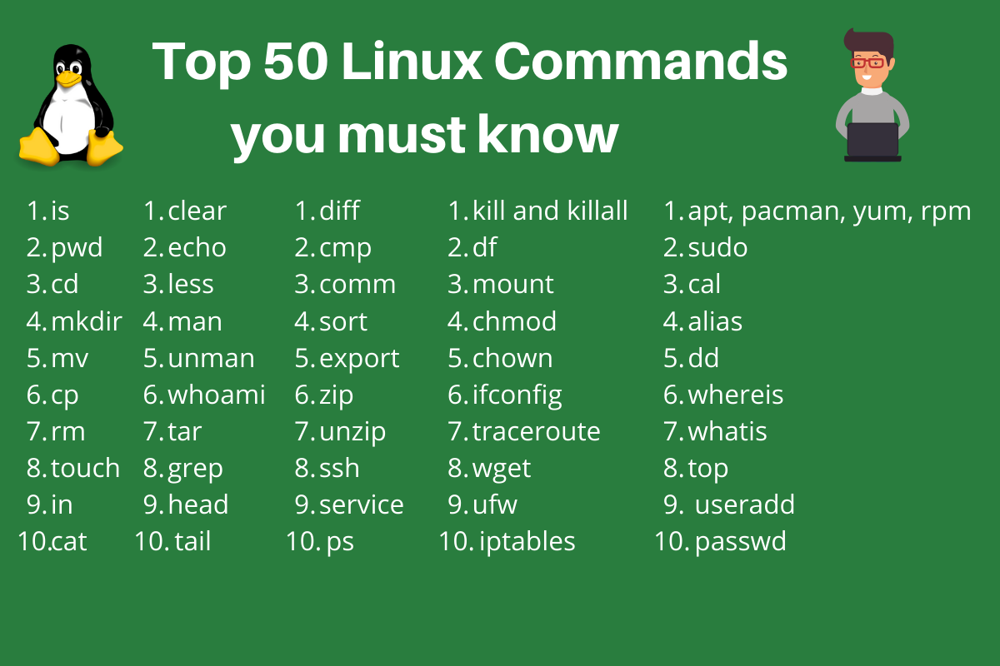
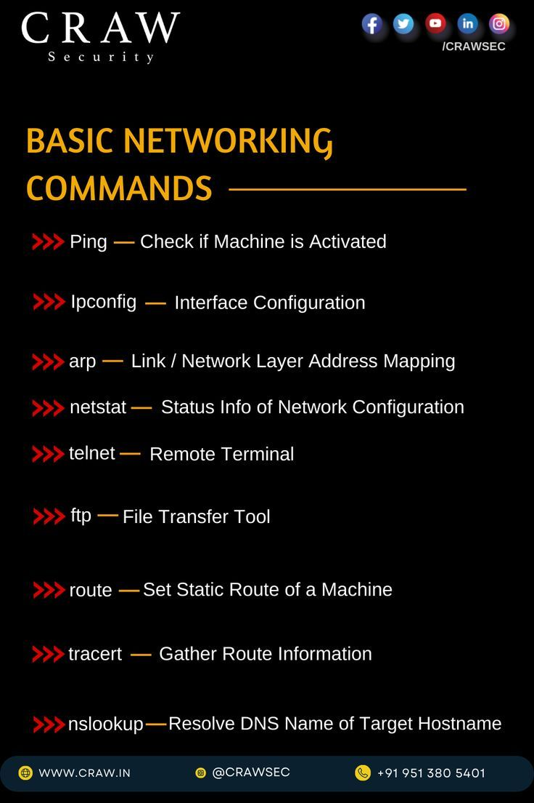
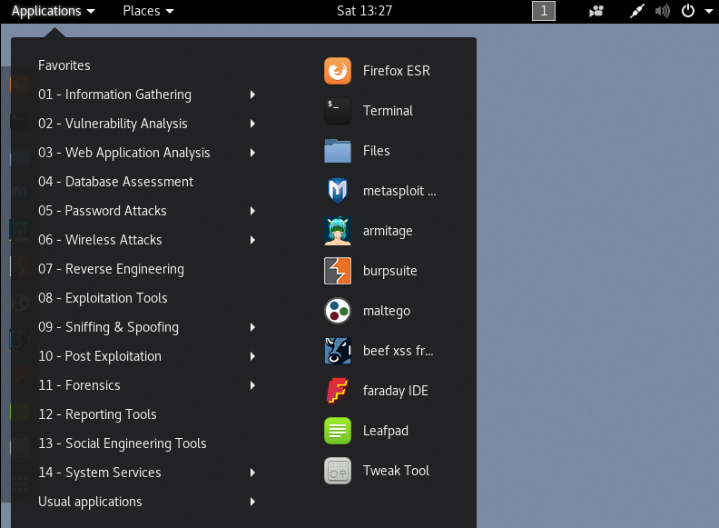

# 🛡️ Cybersecurity Course - Day 04 Report  

📅 **Date:** June 06, 2025  

---

## 🔧 Performing Linux Commands on Kali Linux

### 📌 Basic Linux Commands
- `ls` – List directory contents
- `cd` – Change the directory
- `pwd` – Print working directory
- `mkdir` – Make directories
- `rm` – Remove files or directories
- `cp` – Copy files and directories
- `mv` – Move or rename files

---

### 🌐 Networking Commands
- `ifconfig` – Display network configurations
- `ping` – Test connectivity to another system
- `netstat` – Show network statistics
- `traceroute` – Show route path to a host
- `nslookup` – Query Internet name servers

---

### 🛠️ System Administrative Commands
- `sudo` – Execute command as superuser
- `top` – Show running processes
- `ps` – Show currently running processes
- `df` – Display disk space usage
- `free` – Show memory usage

---

## 🌐 What is DNS and How It Works?

**DNS (Domain Name System)** translates human-readable domain names (like `www.google.com`) into IP addresses (like `142.250.196.68`) which computers use to identify each other.

### 🔄 DNS Working Flow:
1. User types a website address into the browser.
2. The query goes to the DNS resolver.
3. Resolver contacts the root server, TLD server, and authoritative server.
4. The IP address is returned and the website is loaded.

---

## 🧑‍💻 Host vs Localhost

- **Host**: A device (computer/server) connected to a network.
- **Localhost**: Refers to the local computer being used; IP address is `127.0.0.1`.

Localhost is commonly used for testing and development.

---

## 🕵️ Reconnaissance in Cybersecurity

Reconnaissance is the first phase of ethical hacking and penetration testing. It involves gathering as much information about the target system before launching an attack.

### 🧰 Types of Reconnaissance:
- **Passive Reconnaissance**: Collecting data without interacting directly (e.g., WHOIS, DNS records).
- **Active Reconnaissance**: Directly interacting with the target (e.g., ping sweeps, port scans).

---

## 🖥️ Applications in Kali Linux

Kali Linux comes pre-installed with numerous cybersecurity tools.

### 🔍 Common Tools:
- **Nmap** – Network mapping
- **Wireshark** – Packet analysis
- **Metasploit** – Exploitation framework
- **Burp Suite** – Web vulnerability scanner
- **Hydra** – Password cracking

---

### ✅ Summary
Today’s session covered essential Linux commands for cybersecurity, explored DNS mechanisms, understood host vs localhost, dived into reconnaissance tactics, and looked at popular Kali tools. Each topic builds strong foundations for ethical hacking.

